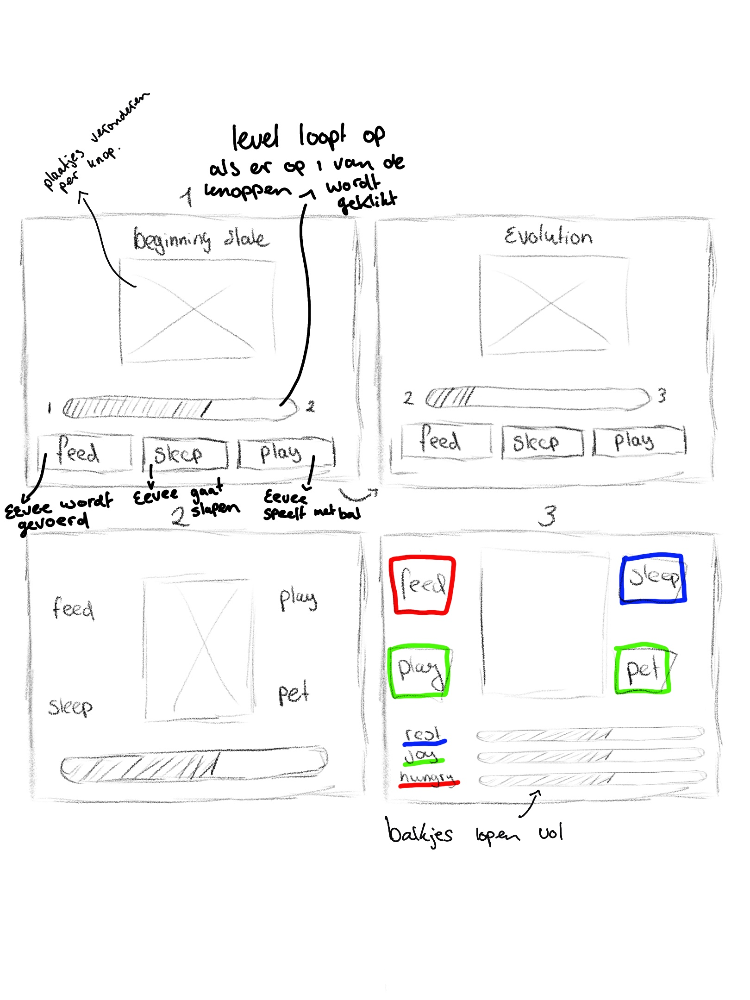

# Inleiding_Programmeren_2223

#### Week 1

  
Deze week had ik het heel erg druk met het opstarten van mijn andere vakken die ik dit blok nog heb. Ik heb schetsen gemaakt hoe ik ongeveer wil dat mijn website eruit ziet (nog echt de basis) en ik ben begonnen met het tekenen van mijn tamagotchi, namelijk Eevee.

    

   

#### Week 2

  
In de eerste les heb ik mijn wireframes gemaakt hoe ik wil dat het eruit komt te zien en wat er gedaan kan worden op mijn website.

   

